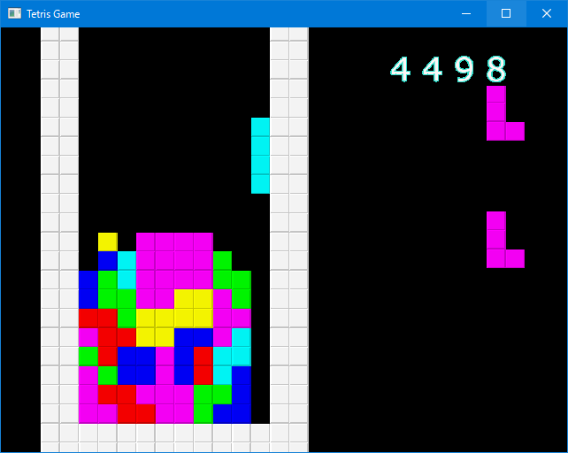

# OpenGL_Tetris
This is Tetris game developed with OpenGL.

## Setup
1. Open Tetris.sln with Visual Studio 2015 or later.
2. Build and run.

## Dependencies
This project has dependencies described below, but these are included in the project, so you don't need to grab them manually.

* GLFW 3.2.1
* glad

## License
MIT.